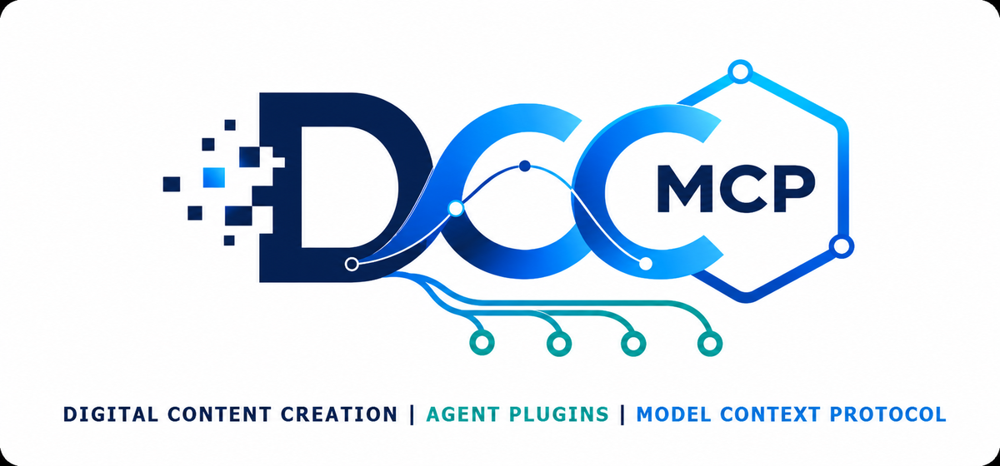

# DCC-MCP Agent Plugins

<picture>
  <source media="(prefers-color-scheme: dark)" srcset="./plugins/dcc-mcp/assets/logo-dark.png">
  
</picture>

The official distribution repository for DCC-MCP Agent Skills across Codex,
Claude Code, CodeBuddy, WorkBuddy, OpenClaw, ClawHub, Gemini CLI, GitHub
Copilot, Cursor, Windsurf, OpenCode, Cline, Roo Code, Kiro, Amp, and other
Agent Skills-compatible hosts.

One canonical Skill suite lives under `plugins/dcc-mcp/skills/`. Vendor
manifests are thin adapters; they do not fork instructions or runtime behavior.
Released-product discovery is generated from
[`plugins/dcc-mcp/skills/dcc-mcp/references/PRODUCTS.json`](plugins/dcc-mcp/skills/dcc-mcp/references/PRODUCTS.json),
a provenance-bearing snapshot of the official `dcc-mcp-cli dcc-types` catalog
reconciled with the owning adapter repositories. It carries one canonical
identity and bounded aliases per product instead of repeating hand-maintained
product lists across manifests.

## Install

### Most agents (recommended)

Install the default `dcc-mcp` Skill with one command. The installer detects
supported agents in the current workspace and lets you choose the target:

```bash
npx --yes skills@1.5.22 add dcc-mcp/dcc-mcp-agent-plugins --skill dcc-mcp
```

This covers Gemini CLI, GitHub Copilot, Cursor, Windsurf, OpenCode, Cline, Roo
Code, Kiro CLI, Amp, OpenHands, Continue, Replit, and other Agent
Skills-compatible hosts. Start a new agent session if the host discovers Skills
only at startup. Use `--global` for a user-level installation or
`--agent <id> --yes` for a non-interactive explicit target; see the installer's
[supported-agent list](https://github.com/vercel-labs/skills#supported-agents).

After installation, prompts only need to describe the work:

```text
Use the dcc-mcp Skill to <describe the DCC task>.
```

The Skill handles DCC discovery, typed tool selection, and approval boundaries.
Install `dcc-mcp-creator` or `dcc-mcp-skills-creator` only when developing an
adapter or authoring a reusable DCC-MCP Skill.

### Portable Agent Plugin

GitHub Release archives include a root `plugin.json` conforming to the
[Agent Plugins 1.0.0 specification](https://agent-plugins.org/) and the same
canonical `skills/` directory. Compatible clients can load the archive as a
skills-only portable plugin; installation and distribution remain
client-defined by the standard.

### Native plugin marketplaces (optional)

Use a native marketplace when the host provides one. It installs the same
canonical Skills.

#### Codex

```powershell
codex plugin marketplace add dcc-mcp/dcc-mcp-agent-plugins
codex plugin add dcc-mcp@dcc-mcp
```

#### Claude Code

```text
/plugin marketplace add dcc-mcp/dcc-mcp-agent-plugins
/plugin install dcc-mcp@dcc-mcp
```

#### CodeBuddy

```powershell
codebuddy plugin marketplace add dcc-mcp/dcc-mcp-agent-plugins
codebuddy plugin install dcc-mcp@dcc-mcp
```

#### WorkBuddy

Add this repository URL from **Plugins > +**, or upload a standalone Skill ZIP
from the GitHub Release to **Skills > Add skill > Upload skill**.

#### OpenClaw and ClawHub

```bash
openclaw skills install @loonghao/dcc-mcp
openclaw skills install @loonghao/dcc-mcp-skills-creator
openclaw skills install @loonghao/dcc-mcp-creator
```

Direct ClawHub installs are also supported:

```bash
npx --yes clawhub@0.23.1 install @loonghao/dcc-mcp
npx --yes clawhub@0.23.1 install @loonghao/dcc-mcp-skills-creator
npx --yes clawhub@0.23.1 install @loonghao/dcc-mcp-creator
```

### Smithery Skills

The three canonical Skills are mapped to Smithery's GitHub-backed Skills
Registry. Search and install them with the Smithery CLI:

```bash
npm install -g smithery@latest
smithery skill search "dcc-mcp"
smithery skill add loonghao/dcc-mcp --agent claude-code
```

Maintainers can validate the mapping locally, then publish only with an
explicit flag and `SMITHERY_API_KEY`:

```bash
python scripts/smithery_sync.py
SMITHERY_API_KEY=... python scripts/smithery_sync.py --publish
```

### npm

The same canonical Skills ship as a package for hosts that vendor Skills
through `node_modules`:

```bash
npm install @dcc-mcp/skills
npx --yes skills@1.5.22 experimental_sync
```

### PulseMCP

PulseMCP is an MCP Server directory, not a raw Agent Skills registry. This
repository therefore does not publish Skill ZIPs there. Submit a hosted or
local DCC-MCP Server from the owning adapter/core release through
[`pulsemcp.com/submit`](https://www.pulsemcp.com/submit); keep Agent Skills on
Smithery, ClawHub, or an Agent Skills-compatible host.

## Catalog and discovery

Every release publishes a machine-readable catalog and GEO metadata to GitHub
Pages, generated from the same manifests CI validates:

| File | Purpose |
|---|---|
| [`catalog.json`](https://dcc-mcp.github.io/dcc-mcp-agent-plugins/catalog.json) | Skill metadata, install commands, and distribution channels |
| [`llms.txt`](https://dcc-mcp.github.io/dcc-mcp-agent-plugins/llms.txt) | Curated entry point for AI crawlers and answer engines |
| [`llms-full.txt`](https://dcc-mcp.github.io/dcc-mcp-agent-plugins/llms-full.txt) | Every `SKILL.md` concatenated in full |
| [`sitemap.xml`](https://dcc-mcp.github.io/dcc-mcp-agent-plugins/sitemap.xml) | Per-Skill pages carrying `schema.org/SoftwareApplication` JSON-LD |

`catalog.json` also projects the complete released-product matrix and the
application UI route. Typed DCC-MCP tools remain first. `DCC-CUA` and
`ui-control` are searchable names for the same project-owned application UI
provider across DCC, browser, and non-DCC apps; explicit DCC-CUA requests never
fall back to generic Computer Use, Browser, or Chrome providers.

`docs/DISTRIBUTION.md` is generated from the same source and lists every
channel plus ready-to-paste entries for the directories that need a human
submission. CI fails when it drifts:

```powershell
python scripts/build_geo_site.py          # regenerate site/ and docs/DISTRIBUTION.md
python scripts/build_geo_site.py --check  # fail when the committed doc is stale
```

## Skill suite

| Skill | Purpose |
|---|---|
| `dcc-mcp` | Operate live DCC applications through structured tools |
| `dcc-mcp-skills-creator` | Create and validate DCC-MCP Skills |
| `dcc-mcp-creator` | Create and modernize DCC-MCP adapters |

Skill instructions are authored in `dcc-mcp-core`, next to the runtime they
document; this repository owns distribution — product discovery metadata,
vendor manifests, archives, GitHub Releases, ClawHub, and Smithery. Content is copied by
`scripts/sync_core_skills.py` from the Core commit pinned in
[`.github/core-skills-sync.json`](.github/core-skills-sync.json), and CI fails
when the two sides drift. See
[`docs/adr/0002-skill-sync-direction.md`](docs/adr/0002-skill-sync-direction.md).

The sync preserves only bounded distribution-owned data: each Skill version,
plus the default Skill's generated description, search hint, tags, OpenAI
interface, marked product/UI routing block, and `PRODUCTS.json`. Core continues
to own the remainder of the instructional body and every other file.
Conditional DCC-CUA routing is deliberately not declared as a hard `depends`
edge, so typed-tool tasks keep progressive loading and do not load the UI
provider unless UI behavior is actually required.

The Skill suite version is this repository's own release line, deliberately
decoupled from `dcc-mcp-core` release numbers: Skill content can be re-published
without a Core release, and Core can release without changing Skill content.
`metadata.dcc-mcp.version` in each `SKILL.md` is therefore the one field the
sync preserves instead of copying.

```powershell
# Re-sync after Core changes Skill content, then bump the suite version.
python scripts/sync_core_skills.py --source ../dcc-mcp-core
python scripts/sync_product_discovery.py
python scripts/bump_version.py --patch
python scripts/build_geo_site.py
python scripts/sync_core_skills.py --source ../dcc-mcp-core --check
python scripts/sync_product_discovery.py --check --check-core-catalog --check-cli
```

`core-sync.yml` runs that sequence itself every Monday and on demand. When Core
has published newer Skill content it re-syncs, bumps the suite version,
regenerates the distribution metadata, and opens or updates a pull request on
`automation/core-skill-sync`. A Core commit that changed no Skill content opens
nothing. Merging the pull request and tagging `v<version>` is the only manual
step.

Set an `AUTOMATION_TOKEN` secret (a PAT with `contents` and `pull-requests`
write access) so the generated pull request also triggers Validate; the default
`GITHUB_TOKEN` cannot start workflows from its own commits. Without it the
pull request is still opened, just without CI runs.

## Development

```powershell
python -m pip install "dcc-mcp-core==0.20.8"
python -m unittest discover -s tests -v
python scripts/sync_product_discovery.py --check
python scripts/validate_repository.py
npx --yes skills@1.5.22 add . --list
./scripts/build-packages.ps1

codex plugin marketplace add .
codex plugin add dcc-mcp@dcc-mcp

claude plugin validate . --strict
codebuddy plugin validate ./plugins/dcc-mcp
```

Tagging `v<version>` creates a GitHub Release with the plugin and standalone
Skill archives, then fans out to every automated channel: ClawHub, Smithery,
npm, and the GitHub Pages catalog. A final matrix job installs the released
Skills from the public repository on Linux, macOS, and Windows and asserts the
released version, so a broken public install fails the release.

| Secret | Channel |
|---|---|
| `CLAWHUB_TOKEN` | ClawHub |
| `SMITHERY_API_KEY` | Smithery |
| `NPM_TOKEN` | npm (`@dcc-mcp/skills`, published with provenance) |

GitHub Pages must be set to **Build and deployment > Source: GitHub Actions**.
skills.sh has no publish API — it indexes public repositories and ranks them
from anonymous `skills` CLI telemetry — so CI verifies public installability
and never generates install telemetry.

OpenAI and Claude public directories require human review; CI builds and
validates their submission artifacts but does not bypass those review portals.
See [`SUBMISSION.md`](SUBMISSION.md).

## Security boundary

The plugin ships no public MCP server. It connects to the user's local DCC-MCP
gateway through `dcc-mcp-cli`; a public multi-tenant MCP endpoint is a separate
security and deployment product.

Product catalog, package, and CI evidence proves discoverability and artifact
parity only. It does not claim licensed real-host validation for any listed
application.

## License

Repository code is MIT. Published Skill content is MIT-0 as declared by each
`SKILL.md` and required by ClawHub.
